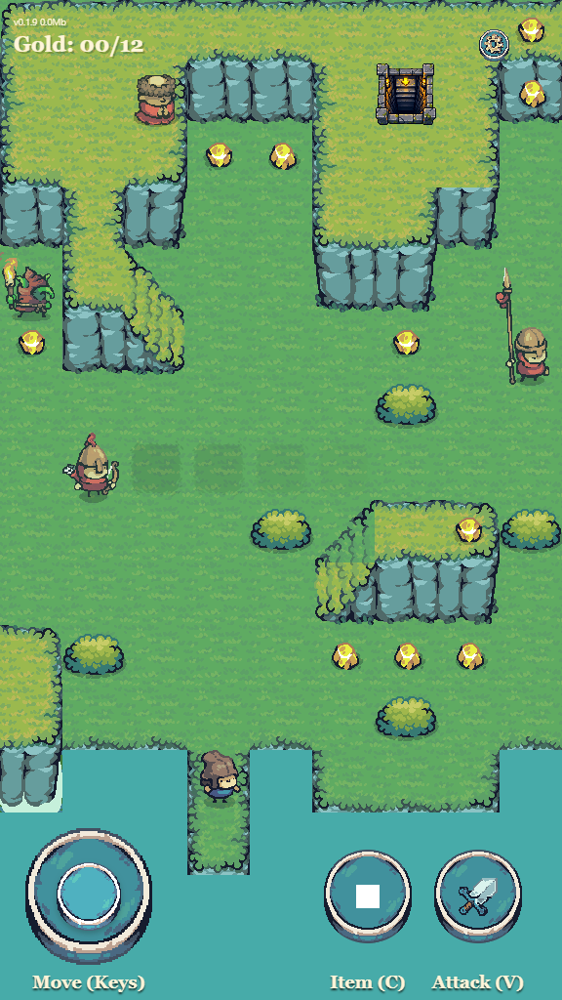

<!-- AI: Customize this README from the repository's actual files, configuration, and user instructions. Preserve the section order, heading styles, and concise format unless asked to change them. Replace placeholders only with verified information; do not invent features, commands, URLs, contributors, or deployment behavior. Keep these instructions hidden as HTML comments. -->
<!-- AI: Preserve the creator banner unless a replacement is requested. Update its relative path if assets move and verify the file exists with matching filename capitalization. -->


# Stealth and Steel

<!-- AI: Use the requested project display name and keep the introduction to one short sentence describing the implemented project and its audience. -->
Stealth and Steel is a portrait-oriented Babylon.js Lite sprite game prototype for developers exploring browser-based games with JavaScript and WebGPU.

## Images

<!-- AI: Use existing project screenshots with relative paths, matching link href and image src, and a 400-pixel preview width. Preserve image order and use descriptive alt text. -->
<a href="STEALTH_STEEL/documentation/images/stealth-and-steel-gameplay.png"></a>

## Demo

<!-- AI: Verify the public demo URL against deployment configuration or the deployed site before changing it. -->
<!-- AI: Do not mention release version numbers anywhere in this README,
including current-release announcements or example release tags, unless the
user explicitly requests it. Do not restore query-parameter advice,
preloader-to-Start-menu explanation, or build-argument/GitHub Actions build
commentary in this Demo section unless the user explicitly requests it. -->
- [https://samuelasherrivello.github.io/stealth-and-steel-game/](https://samuelasherrivello.github.io/stealth-and-steel-game/)

WebGPU not working? See [Troubleshooting](#troubleshooting).

## Table of Contents

<!-- AI: Keep this list synchronized with the top-level sections below it. Exclude the title, Images, Demo, and Table of Contents; do not add subsection entries unless requested. -->
1. [Getting Started](#getting-started)
2. [Project Overview](#project-overview)
3. [Project Details](#project-details)
4. [Resources](#resources)
5. [Credits](#credits)

## Getting Started

<!-- AI: Verify prerequisites and commands against repository configuration. Keep setup in the subsections below and do not add a separate commands section. -->
Use Node.js 22 (the version used by GitHub Actions), npm, and a browser with
WebGPU support. Clone or download this repository and run commands from its root.

### 🛠 Build Project

<!-- AI: Specify the working directory and dependency installation when necessary. Verify build commands against package.json. -->
1. Run `npm install` to install the project dependencies.
2. Run `npm run build` to create the production bundle.

### 🛠 Run Project

<!-- AI: Use the actual local launch command and refer to the printed URL when the port can vary. Avoid repeating completed setup steps. -->
1. Run `npm run dev` to launch the local development server with hot reload.
2. Open the URL printed by Vite.

Use `npm run preview` to serve the production bundle locally after building it.
Run `npm test` for the automated tests and `npm run test:publish` for the Pages
links, screenshot, relative-path, and release-metadata checks.

### 🛠 Release Version

<!-- AI: Describe the checked-in release workflow accurately. Distinguish builds, tags, releases, and deployment; documentation edits do not authorize publishing or changing Git history. -->
1. Run `npm ci`, `npm test`, `npm run test:publish`, and `npm run build`.
   Both the full test suite and focused publishing checks must pass before deployment.
2. Commit and push to `main` in
   [`SamuelAsherRivello/stealth-and-steel-game`](https://github.com/SamuelAsherRivello/stealth-and-steel-game).
   The `Deploy live demo` workflow runs all tests, validates publishing contracts,
   builds `dist`, and deploys it using GitHub Actions. No release tag is needed to publish.
3. Wait for the [deployment workflow](https://github.com/SamuelAsherRivello/stealth-and-steel-game/actions/workflows/deploy-pages.yml)
   to succeed, then verify the [live game](https://samuelasherrivello.github.io/stealth-and-steel-game/).

For a versioned release, also update `STEALTH_STEEL/public/environment.json` and optionally
create a matching three-component GitHub Release tag.
The displayed version comes from that file, not from Git tags.

GitHub repository Settings → Pages → Source must remain **GitHub Actions**.
To redeploy the current branch without a new commit, use **Run workflow** on
`Deploy live demo`. Vite uses `base: "./"`, so asset URLs remain relative to the
Pages project path after a repository rename. If renamed again, update the Git
remote and these README links; keep the workflow branch aligned with the
repository's publishing branch.

To recover from a bad publish, make a corrective commit and push it to `main`;
do not rewrite history or force-push.

## Project Overview

<!-- AI: Describe the current purpose and capabilities; label planned behavior explicitly and keep detailed tooling under Project Details. -->
This repo demonstrates browser-based game development with Babylon.js Lite,
JavaScript, Vite, and WebGPU in a portrait-oriented sprite game.

A Babylon-branded startup preloader appears before the first game graphics,
covers asset loading, and closes after the first rendered frame. Loading errors
show a Retry button. This lightweight screen is local to the project because
Babylon Lite does not ship the full engine's default loading UI.

### 📝 Documentation

<!-- AI: Link to documentation that exists in this repository using relative Markdown links and a short purpose for each. -->
- [README.md](README.md): Primary documentation for this repo.
- [Tile Map Editing](STEALTH_STEEL/documentation/tile-map.md): Tiled map editing workflow.
- [Grid and UI Contract](STEALTH_STEEL/documentation/grid-and-ui-contract.md): Logical grid and UI placement contract.
- [Render Depth Order](STEALTH_STEEL/documentation/render-depth-order.md): Babylon Lite sprite and DOM overlay depth bands.

### 📝 Structure

<!-- AI: List only the paths needed to understand this repository. Verify paths and capitalization; omit generated output and dependency folders. -->
```text
./
|-- .agents/
|-- .codex/
|-- .github/
|-- .openspec/
|   |-- changes/
|   |-- specs/
|   |-- cli.mjs
|   `-- config.yaml
|-- .gitignore
|-- LICENSE
|-- README.md
|-- package.json
|-- package-lock.json
|-- vite.config.js
`-- STEALTH_STEEL/
    |-- documentation/
    |-- plugins/
    |-- public/
    |   |-- assets/
    |   |   |-- audio/
    |   |   |-- images/
    |   |   |   |-- enemies/       # Includes archer
    |   |   |   |-- goals/
    |   |   |   |-- npc/
    |   |   |   |-- particles/
    |   |   |   |-- player/
    |   |   |   |-- terrain/
    |   |   |   `-- ui/            # Includes Tiled spawner icons
    |   |   `-- levels/
    |   `-- environment.json
    |-- src/
    |   |-- runtime/
    |   `-- test/                  # Includes runner and browser checks
    |-- vendor/
    `-- index.html
```

Run npm commands from the repository root. Vite serves `STEALTH_STEEL/index.html`
and writes production output to root `dist/`. Runtime source starts at
`STEALTH_STEEL/src/runtime/bootstrap.js`; `main.js` composes the game scene.
Aseprite sources sit beside their exported images. Files in `public/` are
served and copied into builds, including locally present Git-ignored source art.

## Project Details

<!-- AI: Verify implementation details against repository files and avoid repeating the overview or claiming unverified package versions. -->
Babylon.js Lite powers the graphics and gameplay systems, WebGPU renders the
game in supported browsers, and Tiled authors the terrain map and layers.

### 📦 AI

<!-- AI: List AI tools and specification workflows configured or documented here. Keep official links and concise descriptions; do not copy unverified template claims. -->
- [Codex](https://openai.com/codex/): Agent-assisted development with repository-local skills in `.agents/skills/`.
- [OpenSpec](https://openspec.dev/): Specification-driven development that keeps feature intent, implementation, and current specifications aligned.

#### OpenSpec Workflow

Planning lives only in `.openspec/`. With Node.js 22.15+ and OpenSpec 1.11.0
installed, use `npm run openspec -- <command>` from the repository root, for
example `npm run openspec -- list` or
`npm run openspec -- validate restructure-project-folders --strict`.
The repository adapter handles the CLI's hardcoded folder paths without a
second folder or link and without modifying the installed CLI. If OpenSpec
is installed in a custom location, set `OPENSPEC_CLI` to its `bin/openspec.js`.

| # | Name | Command | Custom | Comment |
| --- | --- | --- | :---: | --- |
| 1 | [Explore](.agents/skills/openspec-explore/SKILL.md) | `/opsx:explore` | ☐ | Optional feature discovery and planning. |
| 2 | [Propose](.agents/skills/openspec-propose/SKILL.md) | `/opsx:propose <name>` | ☐ | Creates one focused feature change. |
| 3 | [Grill Me](.agents/skills/openspec-grill-me/SKILL.md) | `/openspec-grill-me <name>` | ☑ | Resolves design decisions before implementation. |
| 4 | [Apply](.agents/skills/openspec-apply-change/SKILL.md) | `/opsx:apply <name>` | ☐ | Implements and completes one change. |
| 5 | [Sync](.agents/skills/openspec-sync-specs/SKILL.md) | `/opsx:sync <name>` | ☐ | Updates main specs without archiving. |
| 6 | [Archive](.agents/skills/openspec-archive-change/SKILL.md) | `/opsx:archive <name>` | ☐ | Finalizes and archives a change. |

##### Workflow Depth

- LOW: Use no steps. Just chat with a fast model like
  [Spark](https://developers.openai.com/api/docs/models/gpt-5.3-codex).
- MED: Use steps 2/4 with a
  [Luna](https://developers.openai.com/api/docs/models/gpt-5.6-luna) or
  [Terra](https://developers.openai.com/api/docs/models/gpt-5.6-terra).
- HIGH: Use steps 1-6 with
  [Sol](https://developers.openai.com/api/docs/models/gpt-5.6-sol).

### 📦 Packages

<!-- AI: List key packages actually used, based on manifests and configuration. Use official documentation links and explain each role briefly. -->
<!-- AI: The user removed the Mermaid, react-markdown, and @scure/bip39
package entries. Do not reintroduce those entries or their documentation-viewer
and recovery-phrase descriptions anywhere in this README unless the user
explicitly requests it, even if those dependencies appear in the codebase. -->
- [Babylon.js Lite](https://doc.babylonjs.com/lite/01-getting-started) (`@babylonjs/lite`): Lightweight rendering and game APIs.
- [Vite](https://vite.dev/): JavaScript bundling and local development server.
- [Node.js test runner](https://nodejs.org/api/test.html): Built-in automated JavaScript testing.

### 📦 Editor Tooling

- Visual Studio Code: Source code editor.
- Tiled: Tile map and level editor.
- Babylon.js Inspector: Runtime scene inspection.

#### Tile Map

Levels are authored with Tiled. The AI prepares the Tiled project, map,
tilesets, grid, origin marker, layers, properties, and runtime integration; the
human edits content only on the existing layers.

See [Tile Map Editing](STEALTH_STEEL/documentation/tile-map.md) for the open, edit, save,
close, and play workflow.

Level completion offers an optional player-funded trophy through BIS and then **Continue To Next Level** or **Restart Game**. The final level shows **Game Completed**. Levels are catalogued from exact `LevelNN.tmj` filenames; backups are excluded. Run progress is stored per tab, and restarting returns to Level 1 without clearing the wallet. Level 2 is a minimal playable map using existing terrain, three gold pickups and an exit. Game-controlled trophy issuance (X1) is deferred.

### Troubleshooting

#### WebGPU not working?

First, open the [official WebGPU Samples hello-triangle
test](https://webgpu.github.io/webgpu-samples/?sample=helloTriangle). If it does
not render, the browser or device cannot currently run this project's WebGPU
path.

For Chrome-specific troubleshooting, see the official [WebGPU
documentation](https://developer.chrome.com/docs/web-platform/webgpu/). It
covers browser requirements, secure origins, graphics acceleration,
`chrome://gpu`, and the `enable-unsafe-webgpu` development flag.

Third-party references:

- [WebGPU Report](https://webgpureport.org/) shows the detected adapter, limits,
  and features.
- [WebGPU Fundamentals](https://webgpufundamentals.org/) explains compatibility
  mode and its experimental Chrome flag.
- [WebGPU Check](https://webgpucheck.com/) provides browser-specific enablement
  guidance and diagnostics.
- [Can I use: WebGPU](https://caniuse.com/webgpu) tracks current browser support.

## Resources

<!-- AI: Keep relevant external learning links and short descriptions. Preserve Best Practices unless asked to replace it; avoid duplicating local documentation links. -->
- [Best Practices](https://www.SamuelAsherRivello.com/best-practices/) - Procedures prescribed as the most effective.
- [Babylon.js Lite getting started](https://doc.babylonjs.com/lite/01-getting-started) - Introduction to the lightweight engine.
- [Babylon.js Documentation](https://doc.babylonjs.com/) - Engine guides and reference.
- [Babylon.js Playground](https://playground.babylonjs.com/) - Browser-based experiments and examples.
- [Babylon.js Inspector](https://doc.babylonjs.com/toolsAndResources/inspector) - Runtime inspection tools.
- [Vite Documentation](https://vite.dev/guide/) - Development and build tooling.

## Credits

<!-- AI: Preserve established attribution and ownership. Use only confirmed contributor, contact, and license information. -->
### 💡 Contributors

<!-- AI: Preserve contributor credit; do not automatically advance experience counts or their reference year. -->
- Samuel Asher Rivello - Over 25 years of game development XP (2026)

### 💡 Contact

<!-- AI: Preserve confirmed contact destinations and this order. Use readable display URLs without a protocol or trailing slash while keeping the real link targets intact. -->
- [LinkedIn.com/in/SamuelAsherRivello](https://Linkedin.com/in/SamuelAsherRivello) ⭐
- [GitHub.com/SamuelAsherRivello](https://github.com/SamuelAsherRivello/)
- [Twitter.com/srivello](https://twitter.com/srivello/)
- Resume / Portfolio: [SamuelAsherRivello.com](http://www.SamuelAsherRivello.com)

### 💡 License

<!-- AI: Keep the license name linked to the actual relative license file and verify that its terms match this statement. Keep the copyright holder and year consistent with that file. Do not change license terms, ownership, or dates without an explicit request. -->
- Provided as-is under the [MIT License](LICENSE).

- Copyright © 2026 Rivello Multimedia Consulting, LLC.
